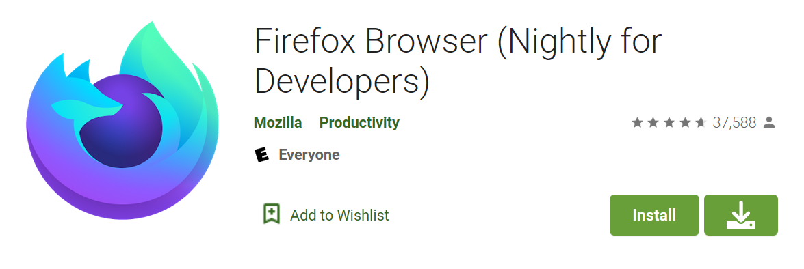

# userscripts/styles

[userscripts](https://greasyfork.org/en/help/installing-user-scripts)
and [userstyles](https://github.com/openstyles/stylus/wiki/Usercss)  I find useful

## userscripts

### eClassGradeCalculator.user.js 

Calculates your grade based on "Relative Weight" and "Contribution to course total" columns. Sometimes these columns are
populated without your grade being revealed, but doing easy math gets us the answer. Probably could be easily extended
to work with Moodle in general, but I don't care.

### githubQuickDelete.user.js 

Helps you delete GitHub repos faster. The script changes the action of the delete button to instantly delete a given
repo.

#### WARNING

Don't actually use this.

GitHub UI designers designed the delete dialog the way they did for a reason. If you use this, you're bypassing that and
making it easier to accidentally delete a repo (It's not always easy to get it back!). Please be aware of that.

#### Demo

https://user-images.githubusercontent.com/26337069/154783066-4548df5d-064f-4177-8538-9f7618a828ea.mp4

### ytCompilationMusicControls.user.js 

Parses a tracklist from a compilation video description to enable usage of media keys to seek tracks within the video (
ie, the next/prev buttons on your keyboard). The now playing information is also set via the mediaSession API.

#### Demo

https://user-images.githubusercontent.com/26337069/154783038-a6b6795b-70b4-409d-bcc3-f03136a71fe1.mp4

[Video](https://www.youtube.com/watch?v=-N-jQzBXkUU) watched in the demo. The chapter list does not need to be open to use this userscript, it was opened to show the video being seeked around to different chapters. Only the media keys are being pressed. The volume/media flyout is provided by [ModernFlyouts](https://modernflyouts-community.github.io/) that integrates with Windows, and not related to this extension.

### googlePlayAPKDownload.user.js 

Adds a button to download the APK from [Evozi](https://apps.evozi.com/apk-downloader/) on the desktop Google Play site

## userstyles

### redditCollapseSidebar.user.css 

Collapses the sidebar when your screen gets to narrow (configurable)
